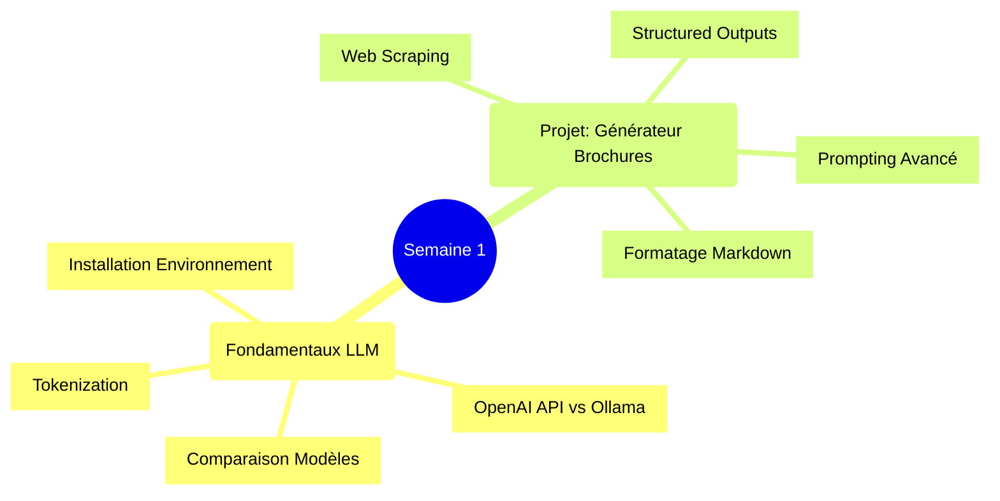

# Semaine 1: Fondamentaux LLM et Générateur de Brochures Marketing 🚀


## 📋 Vue d'ensemble

Ce projet constitue la première semaine du cours Udemy "[LLM Engineering: Master AI, Large Language Models & Agents](https://www.udemy.com/course/llm-engineering)". Il combine l'apprentissage des fondamentaux des LLM avec un projet pratique: un générateur de brochures marketing alimenté par l'IA qui analyse les sites web d'entreprises et produit du contenu promotionnel professionnel.

## 🧠 Structure du Projet



## 🎯 Objectifs d'Apprentissage

- Comprendre les bases de l'ingénierie LLM et l'écosystème des modèles
- Configurer un environnement de développement pour projets LLM
- Maîtriser l'utilisation des API OpenAI et l'inférence locale avec Ollama
- Implémenter un web scraper avec BeautifulSoup
- Générer des réponses structurées en JSON avec les LLM
- Appliquer des techniques de prompting avancées (multi-shot)
- Créer un outil de génération de contenu marketing automatisé

## 🛠️ Technologies Utilisées

- **Environnement**: Anaconda/virtualenv, JupyterLab
- **Langages**: Python 3.10+
- **LLM**: OpenAI API (GPT-4/GPT-4o), Ollama (modèles locaux)
- **Web Scraping**: BeautifulSoup4
- **Sécurité**: Fichiers .env pour stockage des API keys
- **Formatage**: Markdown

## 🔧 Installation et Configuration

```bash
# Cloner le dépôt
git clone https://github.com/votre-username/llm-engineering-course.git
cd llm-engineering-course/week1-brochure-generator

# Option 1: Environnement Anaconda (recommandé)
conda create -n llm-week1 python=3.10
conda activate llm-week1

# Option 2: Virtualenv
python -m venv venv
source venv/bin/activate  # Sur Windows: venv\Scripts\activate

# Installer les dépendances
pip install openai python-dotenv beautifulsoup4 requests jupyter

# Configurer les clés API (créer un fichier .env)
echo "OPENAI_API_KEY=votre-clé-api" > .env
```

## 📚 Contenu du Cours (Semaine 1)

### Jour 1: Introduction et Configuration
- Installation d'Ollama pour déploiement local de LLM
- Configuration de l'environnement de développement (JupyterLab, Conda/virtualenv)
- Feuille de route pour devenir LLM Engineer
- Création d'un .env pour stocker les clés API en sécurité
- Projet "Instant Gratification": Web Page Summarizer avec GPT-4 et BeautifulSoup

### Jour 2-3: Exploration des Modèles LLM
- Comparaison des modèles frontier: GPT-4, Claude, Gemini et modèles open-source
- Utilisation d'Ollama pour l'inférence locale
- Exercices pratiques comparant OpenAI et Ollama pour la summarization
- Évaluation des performances de différents modèles (GPT-4o vs O1, Claude 3.5, etc.)
- LLM Leadership Challenge: évaluation créative des modèles

### Jour 4: Compréhension Technique des LLM
- Évolution des modèles: de GPT-1 aux modèles trillion-paramètres
- Explication de la tokenization dans les LLM
- Impact des context windows sur les performances
- Navigation dans les coûts des modèles: API vs interfaces de chat
- Comparaison des context windows des différents modèles

### Jour 5: Projet de Générateur de Brochures
- Web scraping pour extraire des informations d'entreprise
- Optimisation des réponses JSON structurées
- Création et formatage de contenu pour brochures
- Ajustements markdown et streaming dans JupyterLab
- Prompting multi-shot pour améliorer la fiabilité des LLM

## 💻 Projet Principal: Générateur de Brochures Marketing

### Fonctionnalités
- Extraction de contenu web depuis des sites d'entreprise
- Analyse du contenu avec LLM pour identifier les points clés
- Génération de contenu marketing persuasif
- Formatage en markdown propre et professionnel

### Étapes d'Implémentation

1. **Extraction Web**
```python
import requests
from bs4 import BeautifulSoup

def extract_website_content(url):
    response = requests.get(url)
    soup = BeautifulSoup(response.text, 'html.parser')
    
    # Extraire le contenu pertinent
    title = soup.find('title').text
    paragraphs = [p.text for p in soup.find_all('p')]
    
    return {
        'title': title,
        'content': ' '.join(paragraphs)
    }
```

2. **Analyse LLM pour Extraire les Points Clés**
```python
import openai
import os
from dotenv import load_dotenv

load_dotenv()
openai.api_key = os.getenv("OPENAI_API_KEY")

def extract_key_points(content):
    response = openai.chat.completions.create(
        model="gpt-4",
        response_format={"type": "json_object"},
        messages=[
            {"role": "system", "content": "You are a marketing expert. Extract key information from website content and return it as JSON."},
            {"role": "user", "content": f"Analyze this content and extract: company name, industry, key products/services, unique value proposition, and target audience. Content: {content}"}
        ]
    )
    return response.choices[0].message.content
```

3. **Génération de Contenu de Brochure**
```python
def generate_brochure(company_info):
    response = openai.chat.completions.create(
        model="gpt-4",
        messages=[
            {"role": "system", "content": "You are a professional copywriter creating marketing brochures."},
            {"role": "user", "content": f"Create a marketing brochure for this company: {company_info}. Include: 1) Catchy headline, 2) Introduction, 3) Key benefits, 4) Services description, 5) Call to action. Format in markdown."}
        ]
    )
    return response.choices[0].message.content
```

4. **Application Complète**
```python
def create_brochure(url):
    # Extraire le contenu du site web
    website_content = extract_website_content(url)
    
    # Analyser et extraire les informations clés
    company_info = extract_key_points(website_content['content'])
    
    # Générer la brochure
    brochure = generate_brochure(company_info)
    
    # Enregistrer en markdown
    with open('brochure.md', 'w') as f:
        f.write(brochure)
    
    return brochure
```

### Techniques de Prompting Avancées

1. **Multi-shot Prompting**
```python
def generate_with_multishot(company_info):
    response = openai.chat.completions.create(
        model="gpt-4",
        messages=[
            {"role": "system", "content": "You are a professional copywriter creating marketing brochures."},
            {"role": "user", "content": "Create a marketing brochure for a tech company."},
            {"role": "assistant", "content": "# Innovative Solutions for Tomorrow's Challenges\n\nAt TechCorp, we believe technology should empower your business, not complicate it...[example output]"},
            {"role": "user", "content": "Create a marketing brochure for a healthcare provider."},
            {"role": "assistant", "content": "# Compassionate Care for Every Patient\n\nAt HealthFirst, your wellbeing is our priority...[example output]"},
            {"role": "user", "content": f"Create a marketing brochure for this company: {company_info}. Include: 1) Catchy headline, 2) Introduction, 3) Key benefits, 4) Services description, 5) Call to action. Format in markdown."}
        ]
    )
    return response.choices[0].message.content
```

2. **Structuring Output Format**
```python
def extract_structured_info(content):
    response = openai.chat.completions.create(
        model="gpt-4",
        response_format={"type": "json_object"},
        messages=[
            {"role": "system", "content": "Extract information in the exact JSON format: {'company_name': '', 'industry': '', 'products': [], 'value_prop': '', 'target_audience': ''}"},
            {"role": "user", "content": f"Extract key information from this content: {content}"}
        ]
    )
    return response.choices[0].message.content
```

## 📝 Exercices et Défis

1. **Comparaison de Modèles**
   - Comparer les performances de GPT-4 vs Ollama (modèles locaux) pour la génération de brochures
   - Évaluer temps d'exécution, qualité et coût

2. **Amélioration du Web Scraper**
   - Ajouter support pour les sites dynamiques
   - Extraire images et contenus structurés

3. **Tutor LLM Personnalisé**
   - Développer un tuteur LLM adapté à un domaine spécifique
   - Implémenter des techniques de prompting avancées

## 🔍 Ressources Additionnelles

- [Documentation OpenAI API](https://platform.openai.com/docs/api-reference)
- [Guide d'Installation Ollama](https://ollama.ai/download)
- [Notebook JupyterLab pour le projet](https://github.com/votre-username/llm-engineering-course/blob/main/week1-brochure-generator/notebooks/brochure_generator.ipynb)
- [Guide BeautifulSoup](https://www.crummy.com/software/BeautifulSoup/bs4/doc/)
- [Techniques de Prompting Avancées](https://www.promptingguide.ai/)

## 🚀 Prochaines Étapes

- Ajouter une interface web simple avec Streamlit
- Implémenter le support pour plusieurs langues
- Explorer l'extraction d'informations visuelles
- Intégrer formatage PDF pour les brochures

## 📊 Journal de Progression

### Tâches Complétées
- ✅ Configuration de l'environnement de développement
- ✅ Configuration de l'API OpenAI 
- ✅ Implémentation du web scraper de base
- ✅ Extraction d'informations clés avec LLM
- ✅ Génération de brochures en markdown

### À Faire
- ⬜ Améliorer la qualité du scraping
- ⬜ Implémenter des exemples multi-shot
- ⬜ Ajouter support pour exportation PDF
- ⬜ Comparer performances avec Ollama
